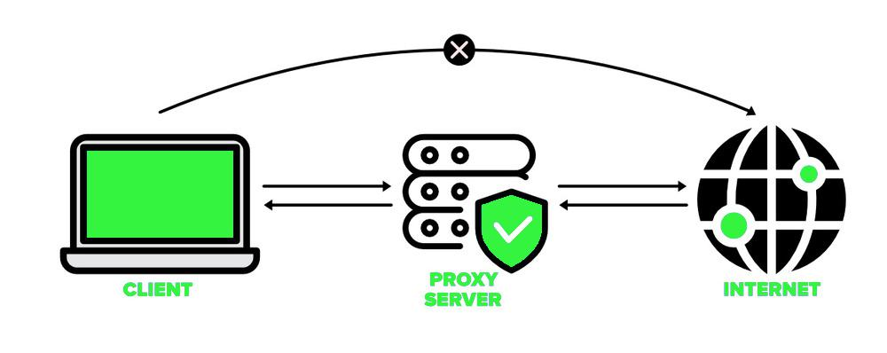
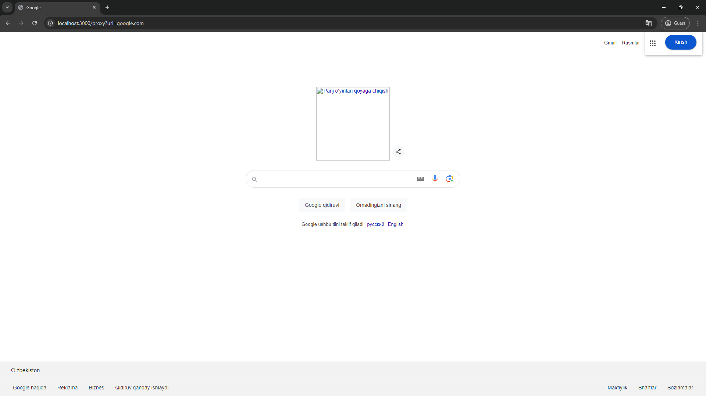

<div align="center">

# { PROXY, PROXIED }
# Author: <a href="https://github.com/jasurhaydarovcode">`jasurhaydarovcode`</a>

</div>


---

# Proxy Server Using Puppeteer


## Overview

This project is a simple proxy server built using **Express.js** and **Puppeteer**. The server fetches and serves web pages while making necessary modifications to the HTML content. It can process JavaScript files, handle favicons, and other assets to replicate the original page's appearance and behavior.

## Features

- **Puppeteer Integration:** Use Puppeteer to fetch web pages, enabling interaction with dynamic content and scripts.
- **Customizable Proxy:** Modify HTML content before serving it to the client, allowing for flexible content delivery.
- **Static File Serving:** Serve static files from the `public` directory using Express.js.

## Advantages



1. **Dynamic Content Handling:**
   - With Puppeteer, the proxy server can handle dynamic content, making it possible to fetch pages that rely heavily on JavaScript for rendering.

2. **Custom Modifications:**
   - The ability to modify the HTML before sending it to the client allows for a wide range of applications, such as injecting custom scripts, altering styles, or filtering content.

3. **Comprehensive Resource Loading:**
   - The proxy can read and process JavaScript files, favicons, and other assets, ensuring that the proxied page closely resembles the original.

4. **Error Handling:**
   - Includes robust error handling, ensuring that even if some resources fail to load, the server can still deliver a functioning page.

## Disadvantages


1. **Performance Overhead:**
   - Using Puppeteer to fetch and render pages can introduce significant performance overhead compared to simpler proxy servers.

2. **Resource Intensive:**
   - Puppeteer requires running a headless browser, which can be resource-intensive, especially when handling multiple requests concurrently.

3. **Limited Scalability:**
   - Due to the resource demands of Puppeteer, scaling this proxy server to handle large volumes of traffic may require substantial infrastructure.

4. **Complex Configuration:**
   - The need to handle various edge cases, such as failed resource loading, and to modify content dynamically, adds complexity to the server configuration.

## Usage

1. **Clone the Repository:**

    ```bash
    git clone https://github.com/yourusername/proxy.git
    cd proxy
    ```

2. **Install Dependencies:**

    ```bash
    npm install
    ```
    or
    ```bash
    yarn
    ```

3. **Run the Server:**

    ```bash
    npm run dev
    ```

    ```bash
    yarn run dev
    ```

4. **Access the Proxy:**

    Open your browser and go to:

    ```
    http://localhost:3000/proxy?url=example.com
    ```

    Replace `example.com` with the URL you want to proxy.

## Examples

### Proxied Google Homepage



### Proxied Example Page


## Conclusion

This Proxy server offers a powerful and flexible solution for serving modified web pages, but it comes with the trade-offs of higher resource usage and potential performance impacts. It's ideal for use cases where dynamic content handling and extensive page modifications are required.

---

**Note:** This is a simple implementation and may need further tuning depending on specific use cases and the scale of traffic it needs to handle.
